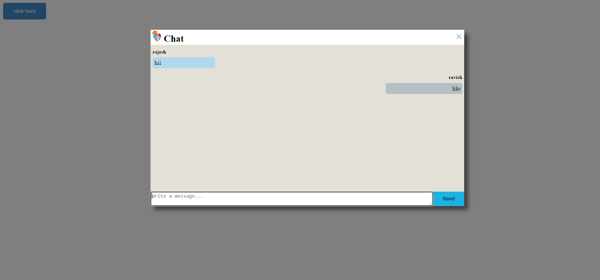
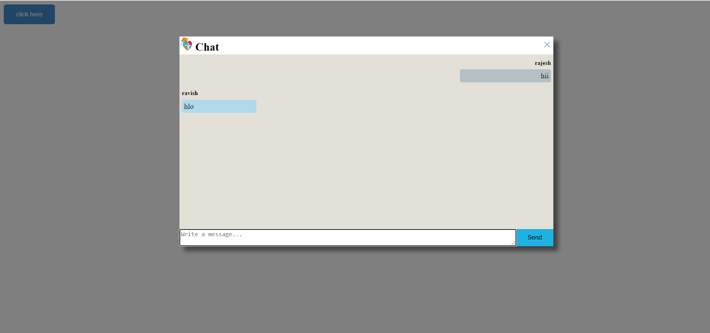
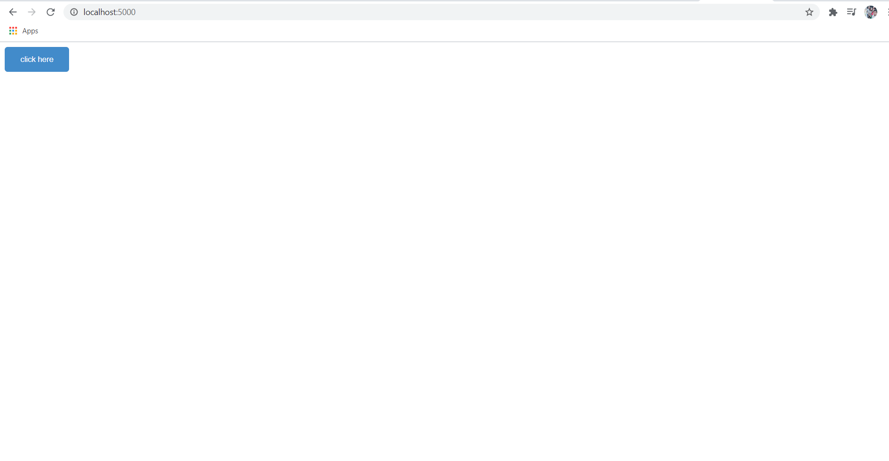

# Real-time-chat

## Table of contents
* [General info](#general-info)
* [Technologies](#technologies)
* [Setup](#setup)

## General info

This is a real-time chat where we can send the message to any active user to any device anywhere.
I build it with the help of socket.io library. on the front of the screen, 
there is a button clicking on that it will ask your user name in a prompt box. 
after it the chat box will pop up and u can chat with all the device who is connected to the server. 
socket.io broadcast the message to all the user.

## Looks






## Technologies

 To create this project we need basic knowledge of Node.js, express and socket.io;
 
 * HTML
 * CSS 
 * Javascript
 * Node.js
 * Express
 * Socket.io


	
## Setup

To run this project, install Node.js in ur local machine,
and another requirement install locally using npm(In the folder where we are working):

```
$ cd chat
$ npm init
$ npm install express
$ npm install nodemon
$ npm install socket.io

```


